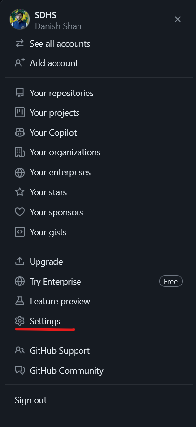
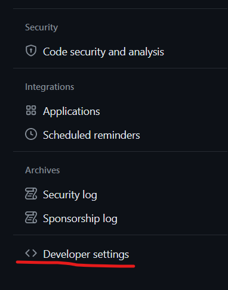
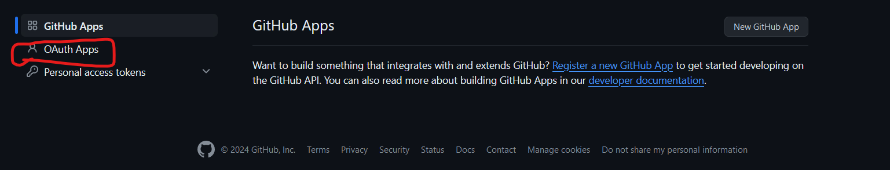
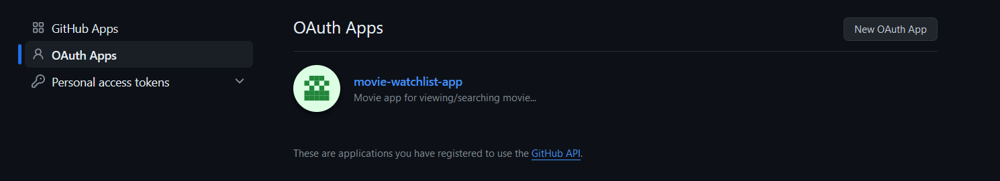
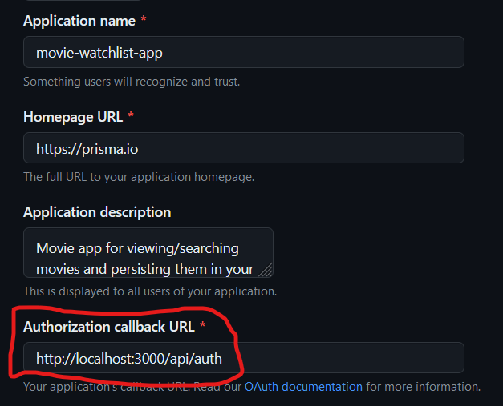
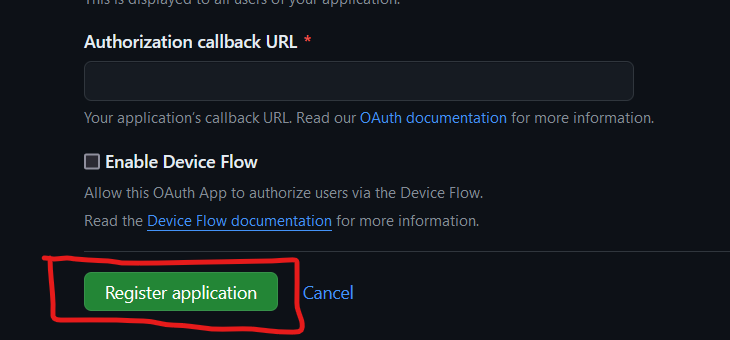
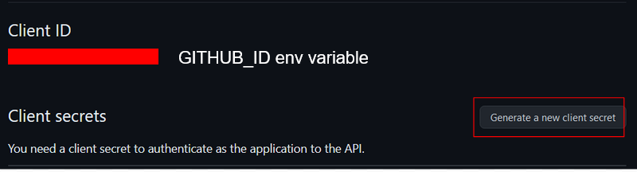
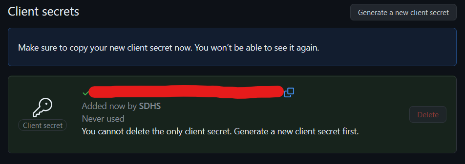

## How to run this project

### Setting Up .env.local

First, we'll need to setup a `.env.local` file in the root directory of the project. We need to populate it with the following content:

```
# NextAuth
NEXTAUTH_URL='http://localhost:3000'
NEXTAUTH_SECRET=<random_string>

# GitHub OAuth
GITHUB_ID=<your_github_id_here>
GITHUB_SECRET=<your_github_secret_here>

#TMDb API key
TMDB_API_KEY=<your_tmdb_api_key_here>
```
First two lines are self-explanatory. In order to get `GITHUB_ID` and `GITHUB_SECRET`:
1. Go to GitHub > Settings:

2. Go to `Developer Settings`:

3. Select OAuth Apps

4. Create a new OAuth App:

5. The first three fields can be set to whatever you like. However, make sure to set the `Authorization callback URL` to `http://localhost:3000/api/auth`. (Enable Device Flow) isn't really relevant here, so keep it empty.

6. Click on Register Application

7. You'll be redirected to the OAuth Application page. Scroll down and click on `Generate a new client`. (`GITHUB_ID` environment variable will already be visible under the heading of `Client ID` at this point):

8. Copy your `GITHUB_SECRET` environment variable. Make sure to copy it without refreshing the page, as it will not be available later.


You should now have all of the environment variables populated in .env.local

### Setting Up Prisma
Run the following command in the terminal (while being in the root directory):
```
npx prisma migrate dev --name init
```

Once both of the above steps (`Setting Up .env.local` and `Setting Up Prisma`) are completed, you can go ahead and run:

```
npm run dev
```

to start a local instance of the project. Open [http://localhost:3000](http://localhost:3000) with your browser to see the result.

Alternatively, you could also run:

```
npm run build
```

and then 
```
npm run start
```
to create and run your build.
